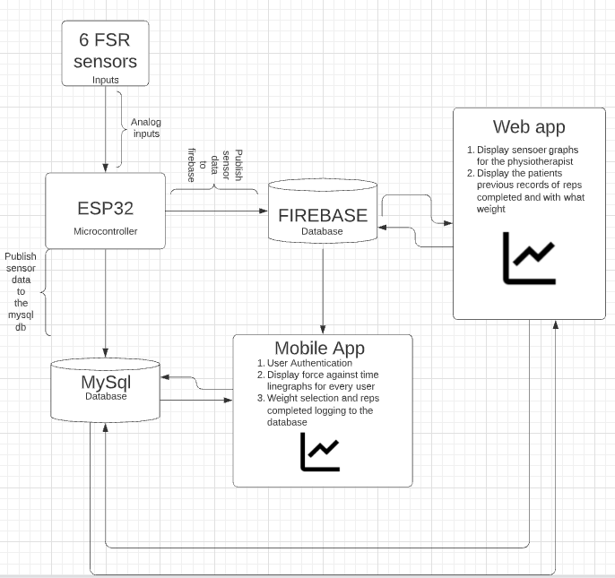
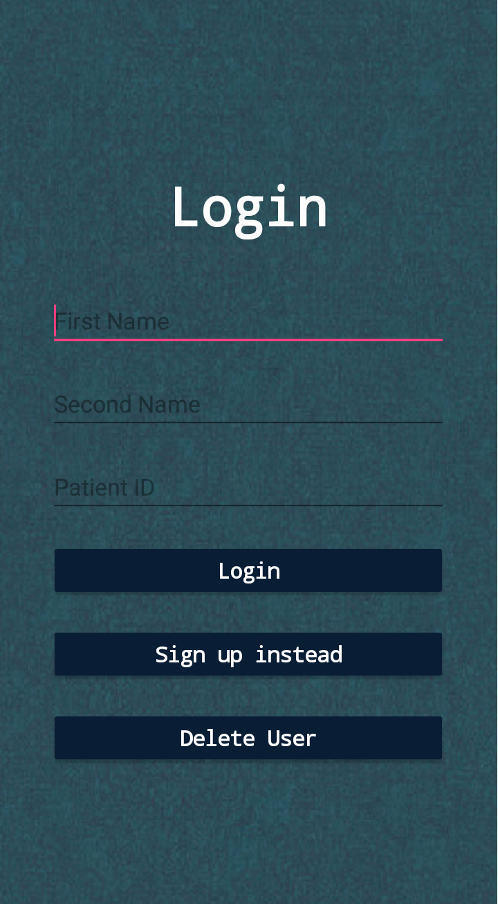
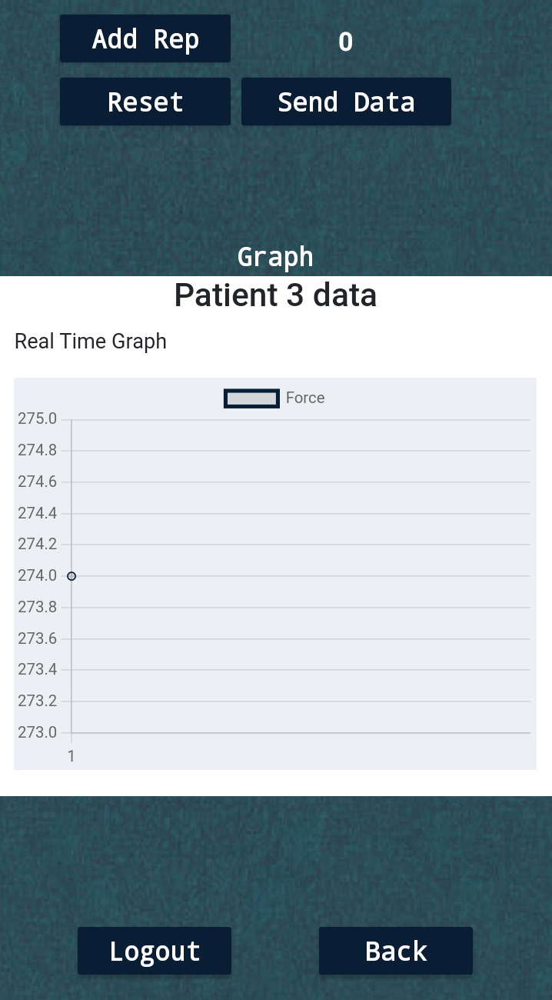
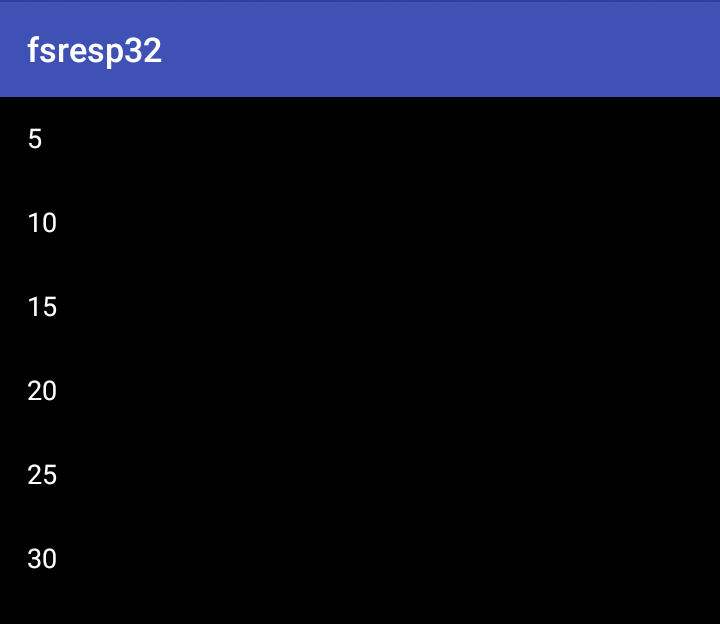
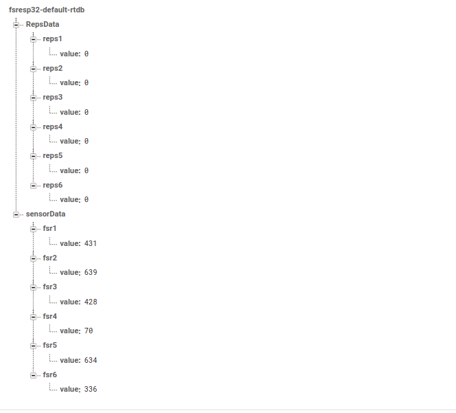
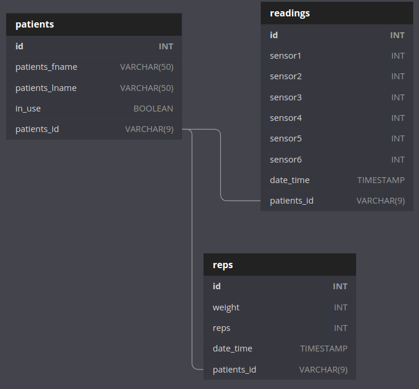

# FSREsp32
## Folder structure
	.
	├── app			# The Mobile app
	├── db			# Mysql database schema sql script
	├── docs		# Documentation directory
	├── libraries	# Arduino libraries used in the firmware
	├── images		# Images directory
	├── webapp		# webapp directory
	└── README.md

## System Architecture
</img>

## Hardware Components
### 1. Esp32 - Microcontroller
- Get analog force from the FSR sensors
- Checks which user is currently logged in on the app before publishing sensor payload data 
- Publish the FSR sensor data to firebase realtime database and the server every 1 minute

### 2. Force Sensing Resistors(FSR 402) sensors
- Read force data from the patient
- A single device should have 6 fsr sensors

## Sofware Components
### 1. Mobile app
- User registration and authentication (login and register)
- Weight selection and reps addition to the database
- Plot real time line graph of data from the microcontroller device(esp32) 
|   </img>  |      </img>     |
|:----------------------------------------------------------------:|:-----------------------------------------------------------------------:|
| </img> | </img> |

### 2. Web app
- No authentication justs serves data to the physiotherapist
- Plot line graphs of weight and reps done for individual patients and displays tables of the same and data from the device

|   </img>  |      </img>     |
|:----------------------------------------------------------------:|:-----------------------------------------------------------------------:|
| </img> | </img> |

### 3. Storage
### Firebase realtime database
- Store force sensor data from the esp32
- Data from the real time database is used to plot real time graph in the mobile app

##### collections
###### Sensor collection and Reps collection
</img>

### MySQL Database
- Stores user credentials during mobile app registration 
- Used for user authentication on the mobile app

##### schema
###### Patients, readings and reps tables
</img>

