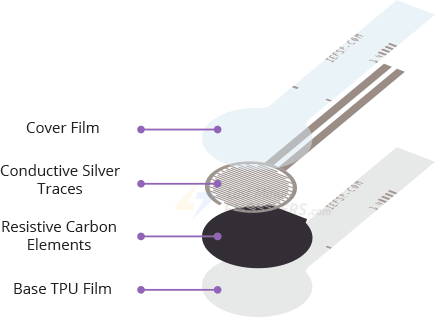
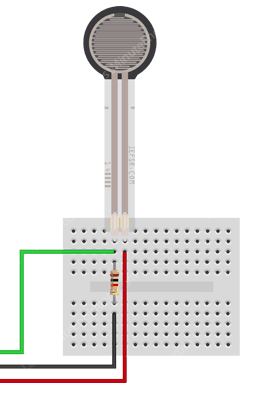
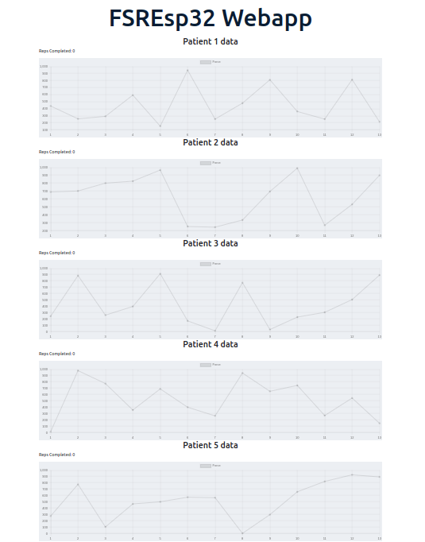

# FSREsp32
## Hardware Components
### 1. Esp32 - Microcontroller
- Get analog force from the FSR sensors
- Publish the FSR sensor data to firebase database every 500 milliseconds

### 2. Force Sensing Resistors(FSR 402) sensors
- Read force data from the patient

#### Interfacing the FSR 402 sensors with the esp32
</img>
You need to connect a 10kΩ pull-down resistor in series with the FSR to create a voltage divider circuit. Then the point between the pull-down resistor and the FSR is connected to an ADC input of an Esp32.

</img>
## Sofware Components
### 1. Mobile app
- User authentication (login and register)
- Plot line graphs of individual FSR sensor data from the ESP32 

### 2. Web app
- Plot line graphs of all individual FSR sensors and reps done by the patient for the physiotherapist
</img>
### 3. Firebase database
- Store user credentials for mobile app authentication
- Store sensor data from the esp32
#### collections
##### 1. Sensor collection - For the sensor data
</img>
##### 2. User collection - For Authentication

