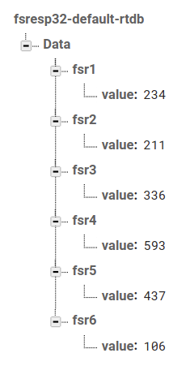

# FSREsp32
## Hardware Components
### 1. Esp32 - Microcontroller
- Get analog force from the FSR sensors
- Publish the FSR sensor data to firebase database every 500 milliseconds

### 2. Force Sensing Resistors(FSR 402) sensors
- Read force data from the patient

## Sofware Components
### 1. Mobile app
- User authentication (login and register)
- Plot line graphs of individual FSR sensor data from the ESP32 

### 2. Firebase database
#### collections

- Store user credentials for mobile app authentication
- Store sensor data from the esp32
